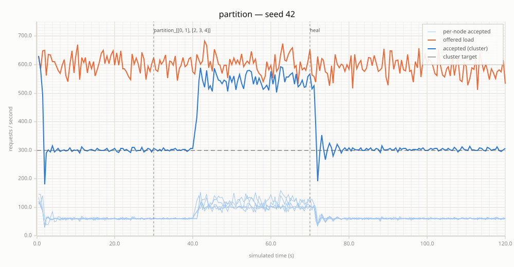
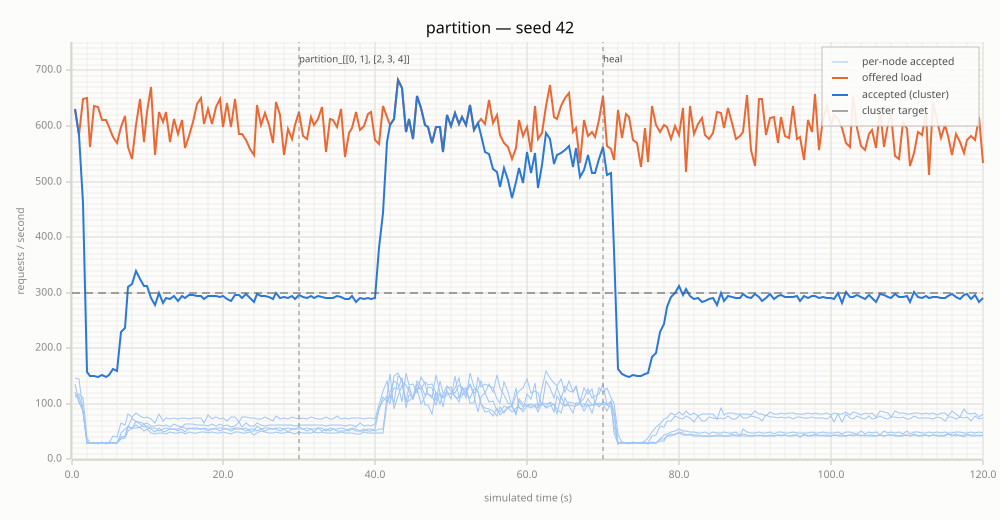
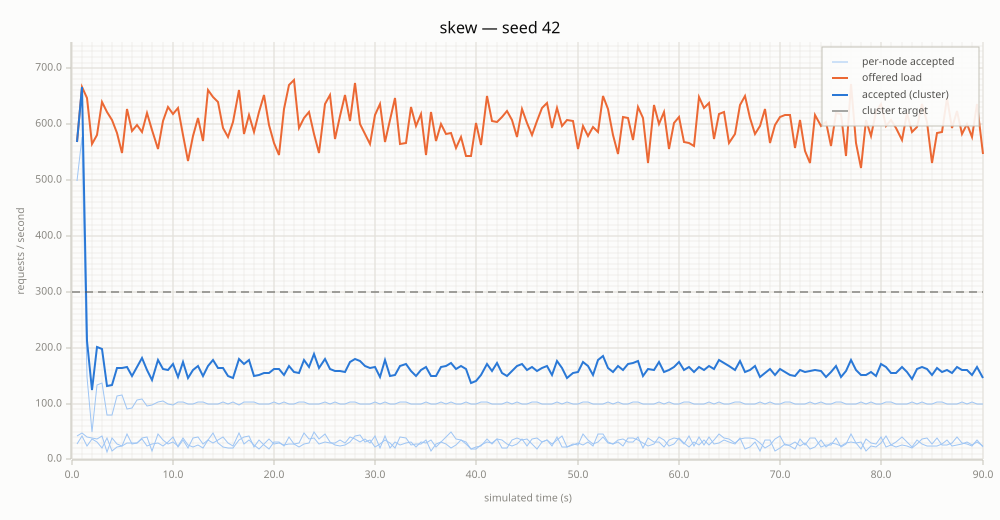
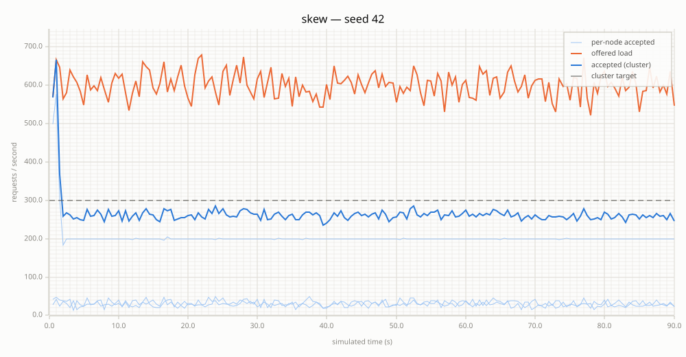
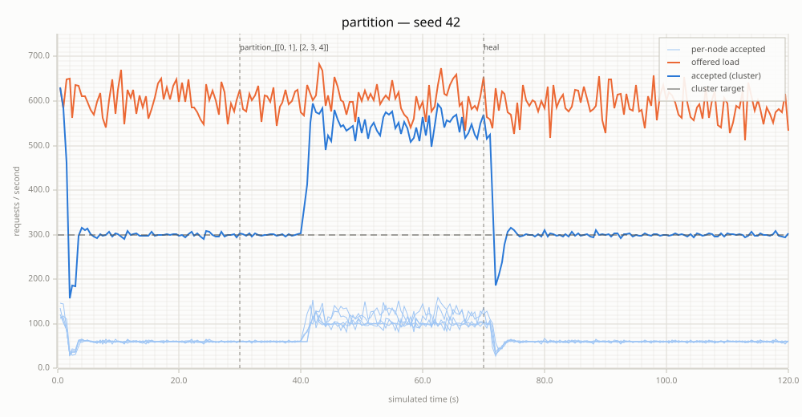
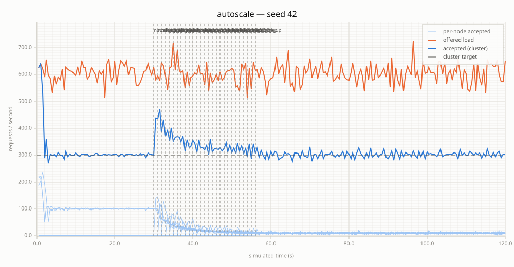

# Engine Comparison (Milestone 5)

Benchmark data behind the recommended default control engine and the
shipped estimator parameters. Everything here is simulator-derived (seed
42, deterministic — see [capacity-model.md](capacity-model.md) for what the
simulator does and doesn't model) and was measured **after** the Milestone
5.4 control fixes (adaptive-window rate estimator, adaptive burst
allowance), which apply to every engine equally. Re-derive with:

```bash
cargo run --features sim --release --example cluster_sim -- --matrix --seed 42
# single engine / parameter overrides:
cargo run --features sim --release --example cluster_sim -- --matrix --seed 42 \
  --engine bayesian --process-noise 1 --measurement-noise 100
# time-series + chart for one scenario:
cargo run --features sim --release --example cluster_sim -- \
  --scenario partition --engine hybrid --seed 42 --plot
```

## The candidates

- **pid** — equal-division PID: each node targets `cluster_target / n` with
  its *local* rate as feedback. Peer observations contribute liveness only,
  so gossip noise cannot enter the loop.
- **bayesian** — estimate-and-set: per-peer scalar Kalman filters
  (random-walk model; staleness = growing variance), node admits the
  headroom under an upper confidence bound of the peer-total estimate.
  No feedback loop of its own; the token bucket enforces the estimate.
- **hybrid** — the same Kalman filter bank feeding a cluster-level PID
  (signal = local + Σ peer means, correction split `/n`).

Engine choice is explicit config (`NENYA_DEFAULT_ENGINE`, per-pattern
`engine`, `SimConfig::engine`); this document only decides the documented
default.

## Verdict

**`pid` ships as the recommended default.** At the shipped
(simulator-verified) tuning it is equal or best on convergence in every
scenario, including the noise-robustness variants, and its feedback path
consumes no gossip data at all — the one engine that cannot be destabilized
by a misbehaving transport.

The niches:

- **hybrid** — chooses slightly less overshoot everywhere (autoscale 1489
  vs 2087 requests, partition 8007 vs 8221) and degrades *gracefully* when
  mistuned, where PID fails catastrophically (see below). Recommended when
  gains will be tuned by hand rather than taken from the shipped defaults,
  or when join/churn overshoot matters more than settling speed.
- **bayesian** — the only engine that serves skewed demand well (87% of
  achievable throughput under the 90%-hot-node scenario vs 54% for pid,
  61% for hybrid) because headroom-based admission is implicitly
  demand-weighted. The cost: chronic mild undershoot under uniform load
  (the `z·σ` conservatism), unfair shares by design, and no convergence
  into the ±5% band at 10+ nodes. Choose it when demand skew is the
  workload, not the exception.

## Full scenario matrix (seed 42, shipped defaults)

Columns: max overshoot (rps) / integrated overshoot (requests) /
integrated undershoot (requests) / time to converge into the ±5% band from
start / steady-state stddev (rps) / per-node fairness CV.

### engine: pid

| scenario | max overshoot (rps) | overshoot (req) | undershoot (req) | converge (s) | steady stddev (rps) | fairness CV |
|---|---|---|---|---|---|---|
| steady_below | 0.0 | 0.0 | 0.0 | 0.5 | 15.0 | 0.033 |
| steady_at | 62.0 | 567.0 | 35.0 | 3.0 | 18.9 | 0.016 |
| steady_above | 340.0 | 547.0 | 147.0 | 4.0 | 3.5 | 0.000 |
| step | 186.0 | 658.0 | 127.0 | 3.0 | 3.8 | 0.000 |
| ramp | 90.0 | 442.0 | 26.0 | 0.5 | 1.6 | 0.000 |
| burst | 2382.0 | 3352.0 | 222.0 | 3.0 | 164.9 | 0.044 |
| join | 352.0 | 874.0 | 248.0 | 4.0 | 3.8 | 0.001 |
| leave | 340.0 | 610.0 | 1180.0 | 4.0 | 2.5 | 0.000 |
| partition | 330.0 | 8221.0 | 213.0 | 4.0 | 4.0 | 0.000 |
| skew | 366.0 | 317.0 | 12303.0 | never | 6.9 | 0.650 |
| sinusoidal | 126.0 | 914.0 | 218.0 | 4.5 | 46.2 | 0.009 |
| autoscale | 340.0 | 2087.0 | 254.0 | 3.5 | 9.2 | 0.015 |
| mass_outage | 344.0 | 838.0 | 1733.0 | 4.0 | 4.9 | 0.001 |
| lossy | 340.0 | 619.0 | 159.0 | 4.0 | 3.1 | 0.000 |
| lossy_heavy | 340.0 | 683.0 | 82.0 | 3.5 | 3.2 | 0.001 |
| jittery | 340.0 | 1070.0 | 124.0 | 4.5 | 3.1 | 0.000 |
| laggy | 356.0 | 1432.0 | 85.0 | 7.0 | 3.2 | 0.000 |
| congestion | 380.0 | 6857.0 | 250.0 | 4.0 | 3.7 | 0.000 |
| scale_2 | 352.0 | 490.0 | 126.0 | 4.0 | 3.1 | 0.000 |
| scale_5 | 330.0 | 565.0 | 119.0 | 4.0 | 4.1 | 0.003 |
| scale_10 | 344.0 | 637.0 | 186.0 | 4.0 | 5.9 | 0.005 |
| scale_50 | 282.0 | 617.0 | 409.0 | 5.5 | 11.5 | 0.013 |

### engine: bayesian

| scenario | max overshoot (rps) | overshoot (req) | undershoot (req) | converge (s) | steady stddev (rps) | fairness CV |
|---|---|---|---|---|---|---|
| steady_below | 0.0 | 0.0 | 0.0 | 0.5 | 15.0 | 0.033 |
| steady_at | 46.0 | 348.0 | 206.0 | 6.0 | 18.7 | 0.032 |
| steady_above | 340.0 | 418.0 | 862.0 | 8.0 | 4.3 | 0.103 |
| step | 62.0 | 258.0 | 410.0 | 6.0 | 3.8 | 0.054 |
| ramp | 148.0 | 823.0 | 562.0 | 0.5 | 1.6 | 0.015 |
| burst | 2382.0 | 3847.0 | 156.0 | 3.5 | 233.8 | 0.017 |
| join | 352.0 | 611.0 | 1506.0 | 9.0 | 7.1 | 0.457 |
| leave | 340.0 | 876.0 | 1871.0 | 8.0 | 2.1 | 0.112 |
| partition | 382.0 | 8525.0 | 2167.0 | 10.5 | 4.2 | 0.288 |
| skew | 366.0 | 351.0 | 3483.0 | never | 7.0 | 0.945 |
| sinusoidal | 126.0 | 1543.0 | 805.0 | 11.5 | 59.7 | 0.019 |
| autoscale | 340.0 | 1039.0 | 4413.0 | 9.0 | 50.8 | 0.591 |
| mass_outage | 348.0 | 1755.0 | 3382.0 | never | 3.7 | 0.143 |
| lossy | 340.0 | 460.0 | 1008.0 | 10.0 | 3.3 | 0.282 |
| lossy_heavy | 340.0 | 500.0 | 1342.0 | 12.5 | 2.9 | 0.171 |
| jittery | 340.0 | 712.0 | 1405.0 | 17.5 | 2.9 | 0.153 |
| laggy | 356.0 | 1304.0 | 1685.0 | 22.5 | 3.7 | 0.169 |
| congestion | 380.0 | 6590.0 | 1635.0 | 8.0 | 3.2 | 0.058 |
| scale_2 | 352.0 | 378.0 | 701.0 | 9.0 | 2.3 | 0.096 |
| scale_5 | 330.0 | 445.0 | 1127.0 | 10.5 | 3.7 | 0.149 |
| scale_10 | 344.0 | 651.0 | 1692.0 | never | 7.4 | 0.267 |
| scale_50 | 334.0 | 3337.0 | 5508.0 | never | 175.0 | 0.039 |

### engine: hybrid

| scenario | max overshoot (rps) | overshoot (req) | undershoot (req) | converge (s) | steady stddev (rps) | fairness CV |
|---|---|---|---|---|---|---|
| steady_below | 0.0 | 0.0 | 0.0 | 0.5 | 15.0 | 0.033 |
| steady_at | 62.0 | 557.0 | 32.0 | 3.0 | 18.2 | 0.017 |
| steady_above | 340.0 | 503.0 | 228.0 | 4.5 | 3.5 | 0.001 |
| step | 176.0 | 518.0 | 88.0 | 3.0 | 3.3 | 0.000 |
| ramp | 100.0 | 330.0 | 56.0 | 0.5 | 1.5 | 0.000 |
| burst | 2382.0 | 3512.0 | 36.0 | 3.5 | 172.8 | 0.025 |
| join | 352.0 | 739.0 | 317.0 | 4.5 | 3.7 | 0.001 |
| leave | 340.0 | 563.0 | 1257.0 | 4.5 | 2.5 | 0.000 |
| partition | 330.0 | 8007.0 | 440.0 | 5.0 | 3.3 | 0.000 |
| skew | 366.0 | 317.0 | 10631.0 | never | 7.1 | 0.735 |
| sinusoidal | 126.0 | 938.0 | 283.0 | 6.0 | 47.7 | 0.009 |
| autoscale | 340.0 | 1489.0 | 542.0 | 5.0 | 8.9 | 0.004 |
| mass_outage | 344.0 | 672.0 | 1965.0 | 5.0 | 3.9 | 0.001 |
| lossy | 340.0 | 580.0 | 233.0 | 5.0 | 3.1 | 0.001 |
| lossy_heavy | 340.0 | 624.0 | 218.0 | 6.5 | 2.7 | 0.000 |
| jittery | 340.0 | 938.0 | 331.0 | 10.5 | 2.8 | 0.000 |
| laggy | 356.0 | 1334.0 | 387.0 | 12.5 | 2.6 | 0.000 |
| congestion | 380.0 | 6738.0 | 415.0 | 4.5 | 2.6 | 0.000 |
| scale_2 | 352.0 | 454.0 | 176.0 | 4.5 | 2.5 | 0.001 |
| scale_5 | 330.0 | 488.0 | 267.0 | 5.0 | 4.2 | 0.001 |
| scale_10 | 344.0 | 523.0 | 369.0 | 5.0 | 7.0 | 0.001 |
| scale_50 | 282.0 | 592.0 | 702.0 | 12.5 | 13.1 | 0.011 |

## Reading the matrix

- **Uniform-load convergence**: pid ≥ hybrid > bayesian. The gap widens
  under transport noise — pid's feedback is purely local, so `jittery`
  (3s message jitter) costs it 0.5s of convergence while hybrid pays 6s
  (its feedback signal is built from those jittered observations) and
  bayesian 13s.
- **Overshoot**: hybrid shaves 10–30% off pid in churn scenarios; the
  Kalman-smoothed cluster estimate reacts to a leave/join slightly before
  the local-only signal does.
- **Skewed demand** (one node gets 90% of 2× target load; achievable
  throughput = 27 000 requests over the run): served throughput is
  **pid 54%, hybrid 61%, bayesian 87%**. Equal division cannot serve a hot
  node beyond `max_rate / n`; bayesian's headroom admission follows demand
  automatically (its fairness CV of 0.945 under skew is that
  demand-weighting, not a defect). None of the engines *converges* under
  skew — demand-weighted division inside pid/hybrid remains future work.
- **Partition** (5 nodes, 2/3 split, 40 s): all engines respect the
  soft-limit worst case and re-converge after heal. Bayesian's UCB makes
  it conservative during the partition exactly as designed
  (undershoot 2167 vs pid's 213) — that is the staleness-as-uncertainty
  policy trading throughput for safety when information is old.

Time-series charts for the interesting cases (blue = accepted, orange =
offered, dashed = target):

| | |
|---|---|
|  |  |
|  |  |
|  |  |

## Parameter sensitivity (mistuning)

PID gains ×4 (kp 2.0, ki 0.08, kd 0.32) vs ÷4, key scenarios:

| engine, gains | steady_above | partition | autoscale | scale_50 |
|---|---|---|---|---|
| pid ×4 | **never** (stddev 165) | **never** | **never** | 14.0s |
| pid ÷4 | 5.5s | 7.0s | 6.5s | 51.0s |
| hybrid ×4 | 7.5s | 9.0s | 7.5s | never |
| hybrid ÷4 | 6.5s | 8.5s | 6.0s | 49.0s |

Overdriven PID hits a permanent ±165 rps limit cycle in the core
scenarios; hybrid at the same gains converges in single-digit seconds —
the Kalman filter between gossip and controller absorbs most of the
mistuning. Both engines just get proportionally slower at ÷4. This is the
main reason to pick hybrid when gains are hand-tuned.

Bayesian estimator grid (q = process noise rps²/s, r = measurement noise
rps²), post-5.4 defaults, key scenarios (converge / undershoot):

| q, r | steady_above | partition | autoscale | scale_10 |
|---|---|---|---|---|
| **1, 100 (shipped)** | 8.0s / 862 | 10.5s / 2167 | 9.0s / 4413 | never / 1692 |
| 10, 10 | 20.0s / 774 | never / 6275 | never / 7367 | never / 3750 |
| 10, 100 | 8.5s / 902 | never / 2644 | 11.5s / 7728 | never / 4313 |
| 1, 1000 | 10.0s / 1152 | 10.0s / 3452 | 11.0s / 5966 | never / 2092 |

The estimate-and-set loop (every node reacts to every other node's rate
through gossip delay) needs a slow Kalman gain to stay damped: `q = 1,
r = 100` is the only stable corner and ships as the default. `r = 100`
is also what Poisson counting noise predicts for a 1 s window at the
benchmark's ~100 rps per-node shares (variance ≈ λ). The hybrid engine
wants the opposite — a fast filter (`q = 10, r = 10`,
`BayesianParams::hybrid_default()`), since its PID supplies the damping;
its results are insensitive to the exact values within ×10 (measured
before the estimator hand-off; the slow bayesian gain measurably delays
hybrid's scale_50 re-entry).

`z` (admission confidence): the sweep showed z mainly trades undershoot
for convergence speed near-linearly with no better setting than the
roadmap's `z = 1`; `z = 0` admits against the raw mean and gives up the
staleness-conservatism property for ~1s faster convergence.

## Hot path

Engines run in the sync-loop cadence (once per second per scope), never
per request. Criterion (`rate_limiter_bench`, `hot_path` group) before vs
after the trait extraction: warm steady-state decision 31 ns → 31 ns
(unchanged); the cold-start case rose 36 ns → 44 ns, which is the one-time
`Box<dyn RateController>` allocation/drop in limiter construction, paid
once per scope, not per decision.

## Caveats

- All numbers are one seed (42) on the simulator's abstract transport;
  ±few-percent scenario-to-scenario variation across seeds is normal and
  the *rankings* above were spot-checked, not exhaustively re-derived, on
  other seeds.
- The convergence detector requires the smoothed rate to hold a ±5% band
  for 5 s; "never" means "did not re-enter the band during the run", not
  divergence — see the undershoot column for how far off an engine sat.
- Skew throughput percentages are `1 − undershoot / achievable` with
  achievable = `min(target, offered) × duration = 27 000` requests.
